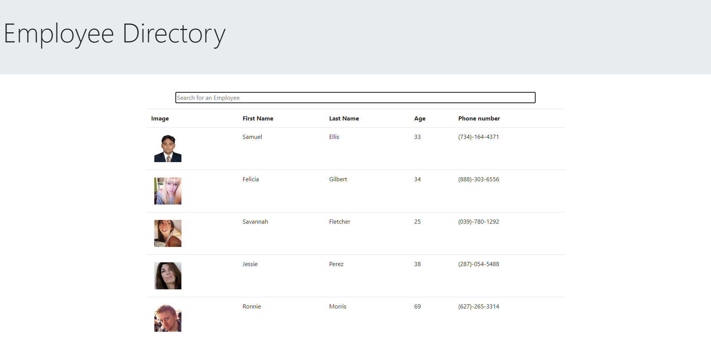

# Employee Directory


## Application Picture


# Technologies Used
    -Reactjs  
    -Javascript
    -HTML
    -CSS
    -GitHub

## Summary
    Built an application that utilizes the techologies above. This application allows the user to search an employee directory, you can sort the employee's by name/age in ascending and descending order.

## Code Snippet
    This part of my code is where I use the sort method to sort the array of the employee's name to ascending or descending order.

```
const sortEmployeeAge = () => {
    const sortedEmployeesAge = [...employees]
    if (isAscending){
      sortedEmployeesAge.sort((a, b) => a.dob.age - b.dob.age)
      setIsAscending(false);
    }
    else {
      sortedEmployeesAge.sort((a, b) => b.dob.age - a.dob.age)
      setIsAscending(true);
    }
    setEmployees(sortedEmployeesAge);
    
  };
```


## Author Links
[LinkedIn](https://www.linkedin.com/in/liamsctewart/)<br>
[Github](https://github.com/LiamStewart8)<br>